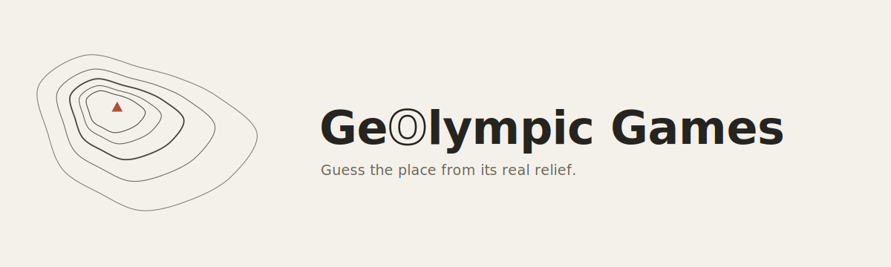

  

<em>Guess a city, an island or a sea from nothing but its real terrain. No labels, no names, just relief.</em>

**Version:** 0.6.0
**Live demo:** [Click here to play](https://florentchevallier.github.io/GeOlympic-Games/)

---

## Concept

Every round shows a circular window onto real, unlabelled terrain and asks one question:
where is this? Most "guess the place" games lean on a labelled map, a flag, or a
street-level photo — this one strips all of that away and asks whether a mountain range,
a coastline, or an island's outline alone is enough to place it.

Three ideas ended up needing three different games. A well-known island, shown at a random
angle instead of the orientation everyone already recognises it from, turns out to be real
brain gymnastics — that's the whole-view island series. Cities read very differently once
only their relief is left: a mountain-locked city and a coastal one are two different
puzzles, solved by zooming out one step at a time on a wrong guess. And seas — apart from
the famous ones — are often barely known at all; given only a small, pannable patch of one,
by its coastal relief or, in the hard variant, by bathymetry alone, how long does it take to
name it?

## Game modes

| Mode | Places | What you see | How you answer |
|---|---|---|---|
| **Mountain cities** | 13 | Real relief in a circle, no coastline to lean on | Multiple Choice or typed answer |
| **Coastal cities** | 14 | Relief with shoreline, bays and deltas | Multiple Choice or typed answer |
| **Islands — whole view (easy)** | 27 | The island fitted to its outline and rotated to a random angle | Multiple Choice or typed answer, single guess |
| **Islands — relief (hard)** | 27 | The zoomed-circle mechanic, applied to islands | Multiple Choice or typed answer |
| **Seas (normal)** | 12 | A pannable patch of coastal/land relief around the sea | Multiple Choice or typed answer, unlimited guesses |
| **Seas (Hard)** | 12 | Underwater topography only — land is left blank | Multiple Choice or typed answer, unlimited guesses |

Places are picked for how well their terrain actually reads, from well-known cases like Hong
Kong and Cuba to more distinctive ones like Sarajevo, Bogotá or Sulawesi. A flat, dry city
like Phoenix shows almost nothing on a relief map at this scale — not obscure, just little
to read — so it was replaced with Athens and its hills. Islands whose shape gives the answer
away on sight, like Australia or Greenland, are left out on purpose; island-nations whose
shape is still a real challenge (Sri Lanka, Cuba, Taiwan, Madagascar) are kept in, and so are
multi-country islands like Borneo and New Guinea.

Seas avoid the obvious ones too — no Mediterranean-as-a-whole, no North Sea — in favour of
sub-basins and lesser-known seas: Adriatic, Tyrrhenian, Ligurian, Ionian, Aegean, Molucca,
Banda, Sulu, Celebes, Sea of Okhotsk, Baltic, Caribbean. Each one's boundary was hand-drawn in
QGIS (5-16 vertices) rather than approximated, and that polygon drives both the round's
starting view and how far the player can pan.

## Rules

A session is 8 rounds.

**Mountain / coastal cities, islands — relief:** 100 base points per round (reduced if you
need to zoom out), +25 for answering within the time window (5s, or 3s in hard-timer mode;
typed mode always uses 5s). A wrong guess zooms out one level instead of ending the round. A
perfect session is 1000 points. Typed-mode hint: a country flag (half points), or an extra
forced zoom-out for islands (flat 10-point cost) — Multiple Choice already gives away the
shape of the answer as a list of names to recognise from, typed mode doesn't, so the hint
exists to give that a partial, costed way out instead of a dead end.

**Islands — whole view:** single guess, same timer/speed-bonus as above; 100 points, halved
if the flag hint was used.

**Seas (normal and Hard):** no timer, no automatic zoom-out. Drag to explore instead, with
two assisted zoom-outs per round and a button to reset to the starting view. Wrong guesses
don't end the round — score starts at 100 and drops by 20 per wrong attempt (floor 20) until
you get it or run out of options. The normal and Hard variants currently differ in one more
way worth naming plainly: normal keeps you inside the sea's real drawn limits but shows no
warning as you approach them; Hard warns clearly with a red edge as you near or cross the
limit, but doesn't stop you going further. Not the original plan, but it plays well enough
as two genuinely different feels that it's staying for now.

No place repeats within a session, in any mode.

## Technology

Single self-contained HTML file — no build step, no backend, no framework.

- **[MapLibre GL JS](https://maplibre.org/)** draws the map, switching at runtime between two
  styles: a hand-verified **[OpenTopoMap](https://opentopomap.org/)** relief raster source
  (real terrain shading, genuinely free of place-name labels — used by cities, both island
  modes, and Seas normal) and a custom **[MapTiler](https://www.maptiler.com/)** bathymetric
  style (Seas Hard only). Both sources' required attribution is embedded in the style itself,
  so MapLibre's own attribution control displays it automatically. The first style tried was a
  custom MapTiler terrain style; testing sources directly in QGIS turned up OpenTopoMap's
  relief-only endpoint, undocumented but genuinely label-free, and closer to the look the
  game was designed around from the start.
- **Rendered at double resolution, then downsampled**: the map div renders at 2× its visible
  size and is scaled back down with CSS, so MapLibre requests one full extra zoom level of
  genuinely finer tiles for every view instead of stretching a coarser one — a clean
  downsample looks sharp, an upscaled blur doesn't. Capped to each style's real native
  resolution so this can't backfire into requesting tiles that don't exist; every padding or
  margin value that feeds a camera fit has to account for that doubled pixel space too.
- Terrain rounds run in MapLibre's **globe projection** (avoids Mercator's pole distortion —
  matters for Antarctica); seas and island-whole-view rounds run in plain **Mercator**, since
  globe projection's pan-boundary and rotated-fit maths had rough edges that made framing
  unreliable. The active projection is tracked in code and only switched when it's actually
  changing — switching mid-camera-move produced a broken transient frame.
- **Background tile prefetching**: while one round is played, the game silently drives a
  second, invisible map instance to the *next* round's location, warming the browser's tile
  cache so the real view appears instantly instead of costing a fast player part of their
  speed-bonus window.
- **Real island and sea geometry**, not freehand guesses. Island outlines come from
  [Natural Earth](https://www.naturalearthdata.com/) (50m, via
  [`world-atlas`](https://github.com/topojson/world-atlas)/`topojson-client`); Borneo and New
  Guinea are cut from the physical landmass rather than a single country's polygon, so the
  shape isn't truncated at a border. Each island's centre and real maximum extent (measured
  from a hand-verified centroid to its farthest vertex) are also stored, so the whole-view
  framing is computed directly rather than left to a generic bounds-fitting function. Sea
  boundaries: hand-drawn in QGIS, sourced as GeoJSON.
- No mapping data is fetched at runtime beyond the map tiles themselves; all place data
  (coordinates, island/sea geometry) is embedded directly in the file.
- **Debug browser** (add `?debug` to the URL): steps through every place in every series,
  name shown, with direct access to each zoom level, each alternate viewpoint, free panning,
  and a raw comparison toggle against another relief source — built to catch bad viewpoints
  or badly-drawn sea limits without having to play full sessions to spot them.

## Data & attribution

- Relief tiles (most modes): **[OpenTopoMap](https://opentopomap.org/)** (CC-BY-SA), built on
  OpenStreetMap and SRTM data.
- Bathymetric style (Seas Hard): **[MapTiler](https://www.maptiler.com/)**, built on
  OpenStreetMap data.
- Island boundary geometry: **Natural Earth**, via `world-atlas`.
- Sea boundary geometry: hand-drawn.
- Mapping library: **[MapLibre GL JS](https://maplibre.org/)**.

## Status & next steps

This is an early, functional prototype built to validate the core mechanics before investing
further in content and polish. Known limitations:

- Place data is hardcoded in the HTML; a future version should load it from separate GeoJSON
  files instead, especially once the list grows further.
- For multi-country islands, the single country-flag hint is a simplification.
- SRTM (the elevation model behind most relief tiles) doesn't cover polar latitudes, so
  Antarctica shows mostly ice rather than real terrain — the game uses a few hand-picked
  coastal viewpoints there instead and never shows the whole continent in one view.
- The banner image lives in `/art` rather than being embedded in the HTML file, so opening
  the game file on its own (outside the repo) will show alt text instead of the banner — a
  deliberate trade-off now that the game is hosted via GitHub Pages rather than meant to be a
  fully offline, single-file download.

On the roadmap, not yet started: player profiles with saved scores, unlocking modes behind a
minimum score elsewhere, achievements, and a way for players to submit new places or ideas.

## Running it

Just open the HTML file in a browser — the game itself is fully self-contained (the banner
image is the one exception, see above). It is also available
[on GitHub Pages](https://florentchevallier.github.io/GeOlympic-Games/). Have fun!
